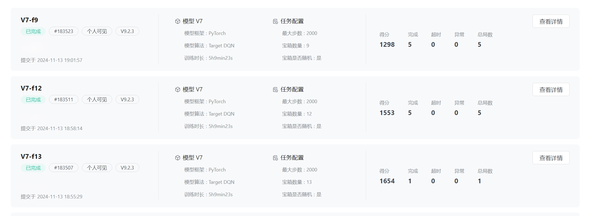

## 自己预测的结果

> 和教学测评一样, 一共三个测试, 最大步数都是 2000 ( 或者 1999, 助教说不能全一样他就改成 1999 了hh ), random 宝箱个数 9/12/13 ( 其实 13 算是确定性环境 )

> 和教学测评的得分差不多, 估计还不错, 但肯定有人能拿满宝箱拿满分, 毕竟我后面改了一些之后也能拿满宝箱, 但是在 f9 下得分不稳定就没用.

用的第七版模型, 算法基本没动 ( 写了个 ppo 但是没跑起来hh ), 用的 target_dqn, 过程改动懒得记载了, 算是相对完善的模型了, 不过算不上最好, 还有改进的空间.

> 加上 V-改进版和一些杂七杂八的模型名字恐怕有 20 多个, 最后只留了几个最后测试

13 个的走路图, 要改进的地方很明显吧, 主要最开始没想到会用这么多宝箱来测评, 而且步数给的也很充足, 要是早知道这样直接纯宝箱优先拿完再取步数惩罚就行了, 再加一个重复路径惩罚就完美了.

> 如果宝箱不满 13 且随机, 步数又比较小, 是有可能出现再最后拿宝箱不如去终点的 ( 毕竟超了分数直接就变 0 了 )

## 简单的描述

> 统计一下一些重要的数据，给的文档实在太零碎了。

|名词|相关|
|:---:|:---:|
| 移动 | 8 个方向，一个动作 3 帧 |
| 宝箱 | 积分 100，13 个配置点位 |
| 加速增益 | 40%, 10s，冷却 90s |
| 视野域 | 51*51，自身中心，四个方向 25 |
| 超级闪现 | 指定方向位移 8000，冷却：120s |
| 终点得分 | 到达终点 150 分 |
| 最大步数 | 用户设定单局最大步数，默认 2000 |
| 超时任务 | 在最大步数内没有走到终点，得分为 0 |
| 完成步数 | 智能体抵达终点所用的步数 |
| 步数得分 | (最大步数 - 完成步数) * 奖励系数 0.2 |
| 宝箱得分 | 一个宝箱 100 分 |
| 任务得分 | 终点得分 + 步数得分 + 宝箱得分 |
| 地图 | 64000x64000，网格的宽度为 500，128x128 的网格 |

## Reward 设计核心

### 1 宝箱优先

诶, 发现没有, 2000 步的情况下, 步数最高得分是 $400-0.2 \times steps$, 我们假设 400 步是完美通关的最小步数, 步数得分也就 320, 也就相当于 3 个宝箱而已, 显然宝箱的奖励是远大于步数的, 或者从另一个角度讲, 去拿宝箱的步数惩罚大概率小于宝箱的奖励, 这就是奖励设计的第一个核心: **宝箱优先**

### 2 闪现方向的控制

观察地图里面宝箱的分布和终点的位置, 我们的出发点显然不是最佳的.

要控制步数, 直接闪现到右边的宝箱就行, 这样能大量减少步数, 甚至不需要在单独写一个重复惩罚的 reward 了. 怎么写? 忘了, 但是我有一版的训练能实现这样操作, 可行性是有的, 懒得找了自己想吧hh.

### 3 衰减因子

不管是宝箱奖励还是步数惩罚, 在这个任务中都有着分段或者说变化的倾向, 宝箱不一定越多越好 ( 如果最大步数不大 ), 步数惩罚一开始也不能过大, 向终点走的奖励一开始也不能太高, 将任务分段成拿宝箱和去终点, 在测试后评估实现步数来进一步细化 reward.

## 可以改进的地方

+ 重复步数惩罚

+ 闪现控制

> 这个大概率只要有重复步数惩罚就能完成

+ 宝箱全拿